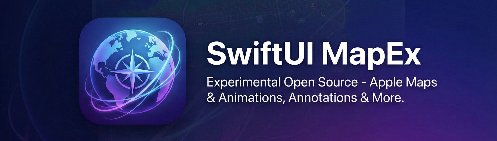
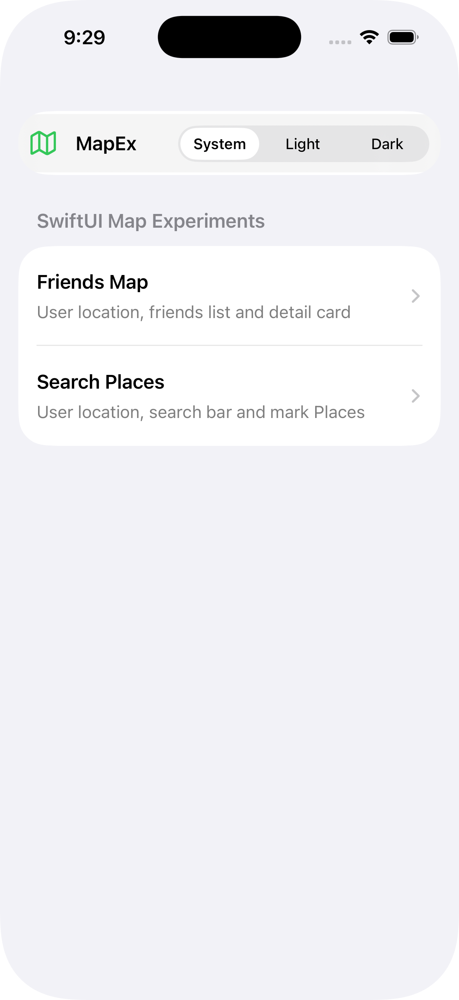
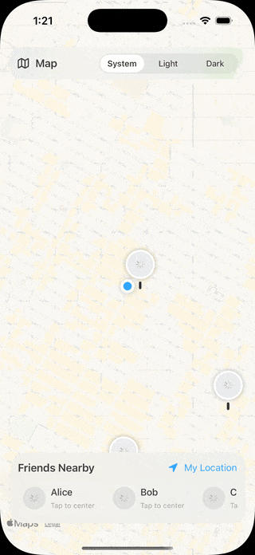
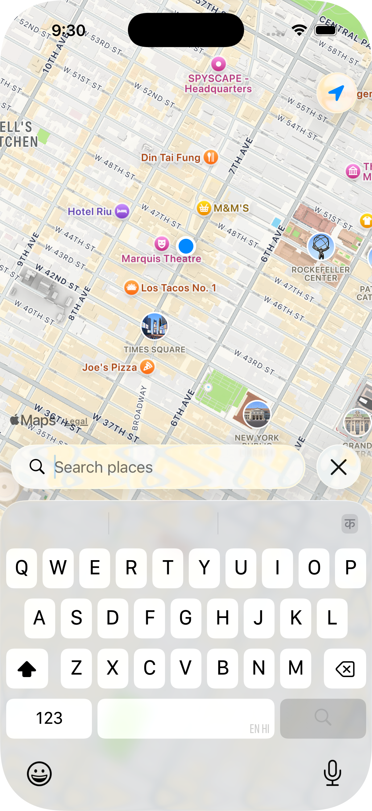

# **SwiftUI MapEx**

**SwiftUI MapEx** is an experimental open-source iOS app showcasing small demos built with **SwiftUI** and **MapKit**.
It includes Apple Maps experiments, custom annotations, light animations, and other UI interaction tests.

This project is meant for learning, prototyping, and exploring ideas.

## **What’s Inside**

* Apple Maps in SwiftUI
* Custom annotations & marker experiments
* Small UI animations & transitions
* Experimental interaction patterns

## Example

<table>
  <tr>
    <td></td>
    <td></td>
    <td></td>
  </tr>
</table>

## **License**

This project is licensed under the **Apache License 2.0**.
