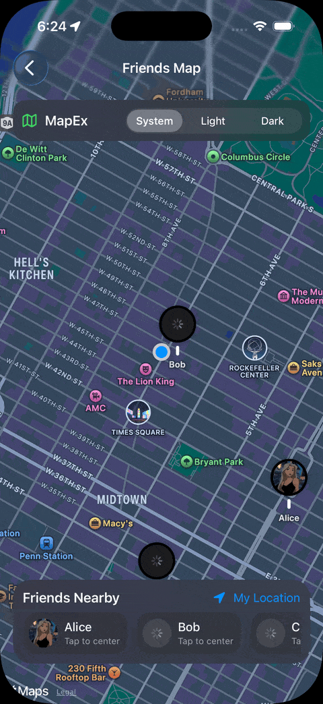
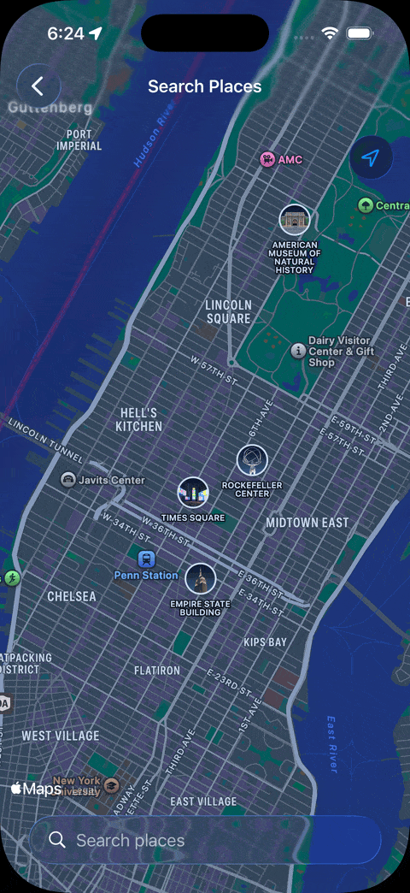

# SwiftUI MapEx 🗺️

Experimental iOS demos built using **SwiftUI** and **MapKit**.

This repository explores:
- Apple Maps integrations
- Custom map annotations
- Interactive UI experiments
- Smooth animations & transitions
- Prototype ideas for map-based apps

Designed for learning, experimentation, and rapid prototyping.

---

## ✨ Preview

  
  
  

## 📚 Purpose

This project is intentionally experimental.

The goal is to:
- explore MapKit capabilities in SwiftUI
- prototype UI ideas quickly
- test animations and interactions
- share reusable concepts with the community

---

## 🤝 Contributing

Contributions, ideas, and improvements are welcome.

1. Fork the repository
2. Create a feature branch
3. Open a Pull Request

---

## 📄 License

Licensed under the Apache License 2.0.
